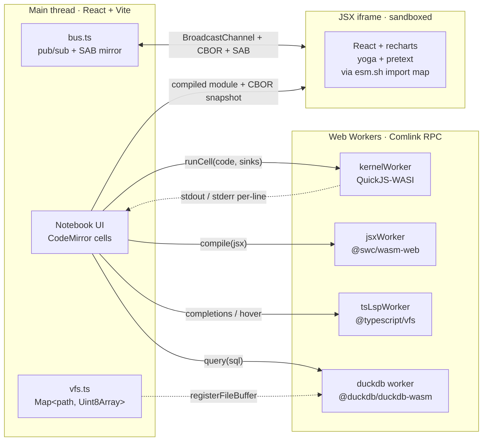
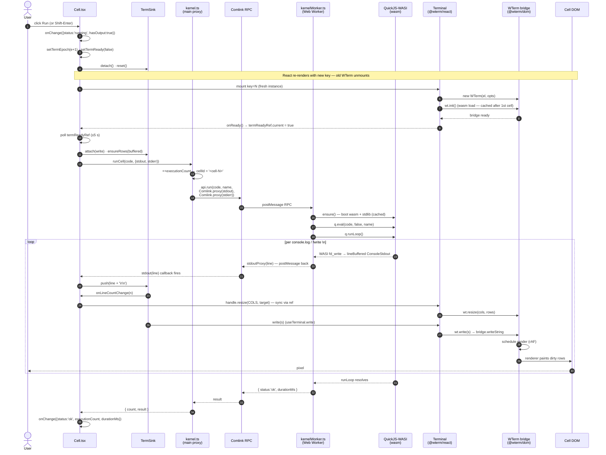
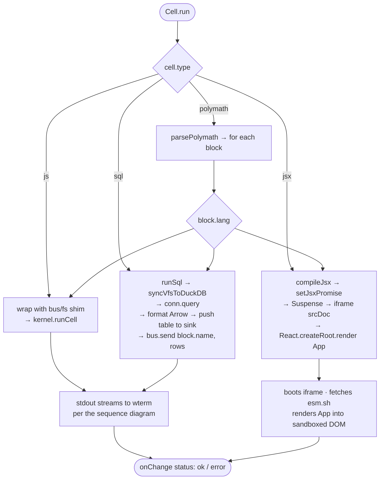

# notepad-js

> **Tap a link, run SQL + JS + JSX, share back the URL.** A polyglot notebook that lives entirely in your browser. No servers, no accounts, no install.

**Live:** https://x7md.github.io/notepad-js/

---

## What

A single-page app with four kinds of cells, all sandboxed, all in-browser:

| Cell         | Runtime                                        | Use case                                         |
| ------------ | ---------------------------------------------- | ------------------------------------------------ |
| **`js`**     | QuickJS-WASI in a Web Worker                   | Capability-controlled sandbox — fresh globals    |
| **`sql`**    | DuckDB-WASM                                    | OLAP queries against in-memory tables / CSVs     |
| **`jsx`**    | SWC → React in a sandboxed iframe              | Live previews with `recharts`, `yoga`, `pretext` |
| **`polymath`** | All three composed                           | Markdown-fenced blocks sharing state             |

Cells talk through two host-managed channels:

- **`bus`** — pub/sub (`bus.send/last/use`) backed by `BroadcastChannel`, CBOR-encoded for cross-context payloads, with an optional `SharedArrayBuffer` mirror when `crossOriginIsolated` is true.
- **`fs`** — a shared in-memory VFS so a JS block can write `orders.csv` and the next SQL block can `SELECT * FROM read_csv('orders.csv')`.

A polymath cell looks like:

````md
```js seed
fs.writeText('orders.csv', 'id,total\n1,12.50\n2,9.99\n3,42.00')
```

```sql totals
SELECT SUM(total) AS revenue FROM read_csv('orders.csv')
```

```jsx view
import { BarChart, Bar, XAxis, YAxis } from 'recharts'
function App() {
  const rows = bus.use('totals') ?? []
  return <BarChart width={420} height={220} data={rows}>{/* ... */}</BarChart>
}
```
````

## Why

Existing notebooks have a hole worth filling:

- **Jupyter / Marimo** need a server. "Share a link" means "set up an env."
- **Observable** is excellent but proprietary, server-backed, requires sign-in to save.
- **CodePen / StackBlitz / CodeSandbox** can't query SQL or run isolated JS engines.

There is no "tap a link on your phone → real notebook → SQL works → JSX renders → no auth → re-shareable URL" tool. This is that tool.

## Who

For developers who want to:

- sketch a data idea against a CSV without spinning anything up,
- write a small interactive component demo,
- share runnable snippets without asking the recipient to install or sign in,
- run untrusted JS from a URL in a real sandbox (not just a Worker).

## Where & When

- **Where**: every byte runs in your browser. The host needs only to serve static files. Currently deployed to GitHub Pages.
- **When**: ongoing. The roadmap below is in priority order.

## Architecture



**Notable choices, briefly:**

- **QuickJS over Worker-only isolation.** A Worker shares the V8 realm; QuickJS gives a *different engine* with a fresh global table. Worth the ~565 KB wasm for capability-controlled execution of code from arbitrary URLs.
- **Comlink everywhere it helps.** Kernel, JSX compiler, TS LSP all expose `Comlink.expose(api)` worker-side and `Comlink.wrap<Api>(worker)` main-side. Status getters stay on the main thread for sync access.
- **GitHub Pages + `coi-serviceworker`.** No backend. The service-worker shim synthesizes `COOP`/`COEP` client-side so `crossOriginIsolated` is true and `SharedArrayBuffer` works on a static host.
- **CBOR for the text-only boundaries.** `BroadcastChannel.postMessage` already handles `BigInt`/`Date` via structured clone; CBOR is only used where we need to embed snapshots in iframe `srcDoc` or QuickJS evals (binary, lossless, BigInt-safe).

### Run flow — click to pixel

The canonical JS-cell path, every hop from a Run click to a paint:



### Dispatch by cell type

The branch at the top of `Cell.run()` — picks the path before the JS sequence above kicks in:



**Two non-obvious things in the flow above:**

- **`__BUS:` / `__FS:` markers** travel back through the *same* stdout stream as normal output. The host-side `busStdout` sink in `Cell.run()` does prefix-detection on each line and routes those to `bus.send()` / `vfs.write()` instead of writing to the wterm. From QuickJS's perspective they're just `console.log`s; from the host's perspective they're side-channel mutations.

- **The Comlink stdout proxy is per-call.** Every `runCell` creates two `Comlink.proxy(callback)` references and passes them as worker args. After the run resolves, those proxies become eligible for GC. Means: ~one postMessage per output line, but the proxy registration cost is per-run, not per-line.

## Quickstart

```bash
git clone git@github.com:X7md/notepad-js.git
cd notepad-js
npm install     # postinstall copies qjs-wasi.wasm into public/
npm run dev     # http://localhost:5173/
```

## Status

- [x] JS / SQL / JSX cells
- [x] Polymath cells (markdown-fenced blocks share state via `bus` + `fs`)
- [x] CodeMirror + TS language service over Comlink (autocomplete, hover, lint)
- [x] CBOR + `SharedArrayBuffer`-mirrored bus snapshot
- [x] GitHub Pages deploy + service-worker COEP shim
- [x] Read-only terminal output with horizontal scroll
- [x] Mobile responsive (toolbar + cell layout)
- [ ] **Gist save/load** — `?gist=<id>` URL shape
- [ ] **Compression-streams + fragment encoding** for offline-shareable URLs
- [ ] **Capability flags per cell** — declare whitelisted host APIs (`bus`, `fs`, network)
- [ ] **Trust UI for shared links** — show cell contents before first run

## Stack

React 19 · Vite · CodeMirror 6 · QuickJS-NG (WASI reactor) · DuckDB-WASM · `@swc/wasm-web` · `@valtown/codemirror-ts` · `@typescript/vfs` · `cbor-x` · `comlink` · `@wterm/react` (output TTY).

## License

MIT.
